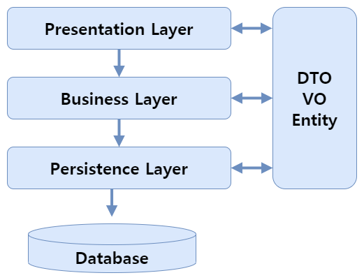

# S/W 아키텍처 패턴

1. S/W 아키텍처 패턴이란
1. Client / Server
1. Pipe Filter
1. MVC
1. Layer
1. Others

## S/W 아키텍처 패턴

소프트웨어를 개발하기 위해 따르는 정형화된 방법.  
용도에 따라 다양한 패턴이 존재한다.

## Client Server Pattern

하나의 서버와 다수의 클라이언트가 존재한다.  
클라이언트가 요청하면 서버가 응답하는 방식.  

예) 웹사이트, 애플리케이션 등

**클라이언트** 서비스를 요청하는 것. 주로 웹브라우저

**서버** 다수의 클라이언트에게 서비스를 제공하는 것. 컴퓨터

웹브라우저하면 무엇이 떠오르시나요? 네 맞습니다. 우리가 매일 사용하는 
구글 크롬, 마이크로소프트의 엣지, 네이버 웨일 등이 바로 웹브라우저 입니다. 
사용자는 이 웹브라우저를 통해 인터넷이라는 바다를 탐험하며 여러가지 웹 서비스를 
누릴 수 있습니다.

## Layered Pattern

시스템을 계층으로 구분한다.  
고전적인 패턴.  
서로 마주보는 계층 사이에서만 상호작용이 발생한다.  

예) 서버 프로그램

### 서버 프로그램의 계층

1. 프레젠테이션 계층 (Presentation Layer)
2. 비즈니스 계층 (Business Layer)
3. 영속 계층 (Persistence Layer)

**프레젠테이션 계층** 클라이언트와 통신하는 계층

**비즈니스 계층** 로직처리.

**영속 계층** 데이터베이스와 통신하며 데이터 저장, 수정, 삭제 등을 명령

*레이어드 아키텍처 그림*

각 계층은 어떻게 작동할까요? 로그인을 하는 과정을 생각해봅시다.

클라이언트가 웹페이지에서 이메일과 비밀번호를 입력한후 제출을 누릅니다.
그러면 로그인 정보가 서버로 전송됩니다. 우선 프레젠테이션 계층이
이 데이터를 받습니다. 그 다음 비즈니스 계층에 전달합니다.

비즈니스 계층은 로그인 과정을 처리합니다. 필요한 경우 영속 계층에
도움을 요청합니다. 영속계층은 데이터베이스와 통신하며
로그인을 시도한 유저가 데이터베이스에 존재하는지, 저장된 비밀번호와 
일치하는지 확인 후 비즈니스 계층에 알려줍니다. 

비즈니스 계층은 로그인 과정을 마저 처리후 프레젠테이션 계층에 결과를 전달합니다. 
프레젠테이션 계층은 마지막으로 로그인 결과를 클라이언트에게 전달합니다.

## Pipe Filter Pattern

입력 데이터(Data source)로부터 데이터 스트림(Data Stream)을 생성한다.  
각 필터는 스트림을 받아 주어진 작업을 수행하고 파이프를 통해 
스트림을 다음 필터로 이동시킵니다.

예) Shell(CLI), 데이터 변환 

### 장점

**모듈성** 각 필터는 독립적인 역할을 수행하므로, 변경 및 재사용이 용이합니다.

**재사용성** 필터는 다른 파이프라인에서도 재사용될 수 있습니다.

**확장성** 새로운 필터를 추가하거나 기존 필터를 변경하여 시스템 확장이 용이합니다.

**유지보수성** 각 필터의 독립적인 역할 덕분에 유지보수가 용이합니다. 

파이프-필터 패턴의 예시를 봅시다.

1 데이터 변환 파이프라인
필터 1: CSV 파일 읽기
필터 2: 데이터 유효성 검사
필터 3: 데이터 변환 (예: 날짜 형식 변환)
필터 4: 데이터 저장 (예: 데이터베이스)

2 네트워크 데이터 처리 파이프라인:
필터 1: 네트워크 패킷 수신
필터 2: 패킷 데이터 추출
필터 3: 데이터 유효성 검사
필터 4: 데이터 분석
필터 5: 분석 결과 저장 또는 전송

## MVC Pattern

Model, View, Controller 컴포넌트로 구성.  
프레젠테이션 계층에서 사용되는 패턴.  
SSR에서 사용된다.

**Model** 데이터베이스와 통신하는 컴포넌트

**Controller** 클라이언트와 상호작용하는 컴포넌트. 

**View** 데이터를 렌더링하고 문서를 생성하는 역할

온라인 쇼핑몰의 상품 목록 페이지가 만들어지는 과정을 따라가봅시다.
사용자는 웹브라우저를 통해 쇼핑몰로부터 상품 목록 페이지를 요청합니다
(html문서에서 주로 링크를 통해 요청이 이루어집니다)

서버는 사용자의 요청을 받고 바쁘게 움직이기 시작합니다.
우선 모델이 데이터베이스로부터 상품 목록 데이터를 가져온 뒤
(사실 직접적으로 소통하진 않습니다. 중간에 더 많은 컴포넌트가 있어요) 
클라이언트와 상호작용하는 컨트롤러에게 전달합니다.

컨트롤러는 뷰에게 이 데이터를 클라이언트에게 전송할 페이지에
렌더링하도록 만듭니다. 컨트롤러는 뷰로부터 완성된 페이지를 받아
클라이언트에게 전송하고 사용자는 마침내 상품 목록 페이지를 볼수 있게 됩니다.

## Master Slave Pattern

마스터가 슬레이브들에게 작업을 분산할당한다.  
슬레이브가 처리한 결과를 마스터에게 반환한다.  

예) 분산 컴퓨터시스템, 데이터베이스 복제

DB 복제를 통해 패턴을 이해해봅시다.
데이터베이스는 CRUD 작업, 즉 데이터 읽기/쓰기/수정/삭제의 4가지 작업을
수행합니다. 이 중에서 가장 비율이 높은 작업은 읽기 작업입니다.
우리가 애플리케이션을 이용하는 경우를 생각해보면 당연한 결과입니다.
대부분의 시간을 콘텐츠를 보는데 사용하니까요.

그런데 만약 하나의 데이터베이스에서 이 4가지 작업을 모두 수행하는 경우
데이터베이스는 지칠 것입니다. 뿐만 아니라 오류가 발생한 경우
애플리케이션 전체가 마비되는 상황에 직면합니다.
이러한 경우를 극복하기 위해 데이터베이스를 복사한 뒤 작업을 나눌 수 있습니다. 

여기서 데이터베이스 원본을 마스터 데이터베이스, 복사본을 슬레이브 데이터베이스라고
부릅니다. 그 다음 마스터는 읽기 요청이 들어오는 경우 직접 처리하지 않고
슬레이브에게 전달합니다.

이렇게 나누어진 데이터베이스 시스템은 효율성 뿐만아니라 안정성에도 도움이됩니다.
만약 마스터에 문제가 생긴 경우 슬레이브가 나머지 작업까지 수행한다면
애플리케이션 마비 또한 막을 수 있습니다

## Broker Pattern

중재자 패턴이라고도 부른다.  
클라이언트와 서비스 사이에서 브로커가 연결을 중개한다.  

장점은 클라이언트와 서버 사이의 복잡한 연결 구조가 필요없다.  
클라이언트와 서비스의 느슨한 결합이 가능하다.

반면 하나의 단일 접점에 문제가 생기는 경우 전체 시스템이 마비 될 수 있다.

### 구성 요소

**클라이언트** 서비스를 요청하는 컴포넌트

**브로커** 클라이어트와 서버 사이에서 중개역할을 하는 컴포넌트

**서버** 서비스를 제공하는 컴포넌트

부동산 매매 과정에 비유해봅시다.
만약 여러분이 새로운 집을 구하고 있는데
부동산 중개업자, 즉 브로커가 없다면 원하는 조건을 가진 집을 찾고,
집주인과 연락하고 약속을 잡으며 집을 보러다녀야 할 것입니다. 피곤하겠죠.

하지만 브로커가 있다면 여러분은 브로커에게 조건만 제시하면
브로커가 내게 맞는 집을 제시해 줍니다. 그리고 브로커를 따라
집들을 보러다니면 되겠죠.

브로커 패턴도 마찬가지입니다. 클라이언트가 필요한 서비스를
일일이 찾아 요청할 필요없이 브로커에게 필요한 서비스를 제시한다면
브로커가 알아서 적절한 서비스에 연결해줄 것입니다.

## Event Bus Pattern

퍼블리셔가 새 메시지를 발행하면 (이벤트) 구독자에게 알림이 가는 패턴

*구성 요소*

- Publisher
- Event Bus
- Subscriber

## Peer to Peer Pattern

피어가 서버가 될 수도 있고 클라이언트가 될 수도 있다  
예) 파일 공유 네트워크

## Blackboard Pattern

명확히 정의된 해결 전략이 발견되지 않은 문제에 대해서 유용한 패턴.  
부분적인 해법, 대략적인 해법을 수립하기 위한 서브시스템의 지식을 조합하는 방법이다.

예) 음성 인식, 차량 식별 및 추적, 단백질 구조 식별, 수중 음파 탐지기 신호 해석

다음의 요소로 이루어져 있습니다.

**블랙보드(Blackboard)**	지식 소스들이 정보를 공유하고 문제를 해결하기 위한 결과를 저장하는 중앙 장소입니다. 모든 시스템이 접근하고 수정 할 수 있습니다.

**지식 소스(Knowledge Sources)**	문제를 해결하는 데 필요한 전문성을 가진 독립적인 시스템입니다. 각 지식 소스는 블랙보드에 있는 정보를 사용해서 문제의 일부를 해결하고 결과를 블랙보드에 저장합니다. 이렇게 함으로써 다른 지식 소스들의 결과를 참조하거나 사용할 수 있습니다.

**제어 요소(Controller)**	문제 해결 과정을 조정합니다. 블랙보드에 있는 정보를 바탕으로 어떤 지식 소스가 다음으로 활동할지 결정하며 문제 해결 과정이 유기적으로 진행 될 수 있도록 합니다.

## Interpreter

번역(Interpret)하는 사물.    
연산은 우선순위가 존재한다. 그것을 처리하기 위해 계층구조(트리)가 필요.

예) 연산, 컴파일러

다음의 요소들로 이루어져 있습니다.

**context**  Expression 에서 사용하는 모든 데이터들이 저장되어있는 공간입니다.

**Expression** 일련의 규칙을 계산하여 결과값을 반환합니다.

**Terminal Expression** Expression을 포함하지 않고, 계산된 결과를 반환합니다. (종료를 포함함 - 더이상 다른 문자로 치환될 수 없는 종점 문자임을 의미합니다.)

**Non-Terminal Expression** Expression 을 참조하여, 종료를 하지 않고 다음 규칙으로 값을 넘기는 역할을 합니다. (다른 문자로 치환됨)

