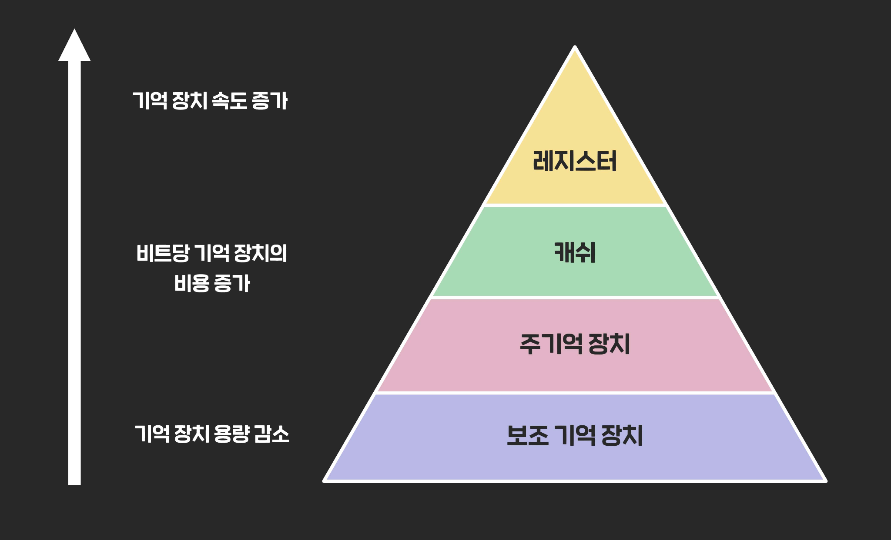
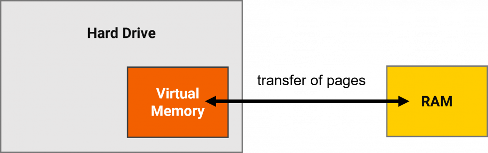

# 메모리

1. 메모리 개념
1. 메모리 종류
1. 관리 전략
1. 가상 기억장치 (Virtual Memory)
1. 페이지 교체 알고리즘


## 메모리 개념

CPU가 작업을 수행하기 위해서 프로그램이나 데이터 등을 일시적 또는 영구적으로 저장하는 장치입니다.

*종류*

- 레지스터 (Register)
- 캐시 (Cache)
- 주기억장치 (Main Memory)
- 보조기억장치 (Secondary Memory)




### 레지스터

CPU 내에 위치합니다. 주기억장치 또는 캐시로부터 데이터를 가져옵니다.


### 캐시

CPU와 주기억장치 사이의 버퍼 역할을 하는 메모리입니다. 
주기억장치와 CPU의 속도 차이를 줄여 처리의 효율을 높이기 위한 목적으로 사용됩니다.
캐시는 자주 사용되는 데이터의 복사본을 저장합니다.


### 주기억장치

CPU가 직접 접근하는 기억장치입니다. 현재 수행중인 프로그램 및 데이터를 저장합니다.
RAM과 ROM으로 구성되어 있습니다.
휘발성


### 보조기억장치

대용량의 데이터를 저장합니다. 주기억장치에 비해 접근 속도가 느립니다.
전원이 차단되어도 내용이 유지됩니다(비휘발성)

e.g) SSD, HDD


## 기억장치 관리 전략

보조기억장치에서 주기억장치로 프로그램을 적재하는 것과 관련된 전략입니다.

*종류*

- 반입 전략 (Fetch)
- 배치 전략 (Placement)
- 교체 전략 (Replacement)


### 반입 전략

보조기억장치에서 프로그램/데이터를 `언제(When)` 주기억장치에 적재할 것인지 결정한다

- 요구 반입
- 예상 반입


### 배치 전략

보조기억장치에서 프로그램/데이터를 주기억장치의 `어디(Where)`에 위치시킬 것인지 결정한다

**First-Fit(최초 적합)** 적재 가능한 공간중에서 첫번째 공간에 배치

**Best-Fit(최적 적합)** 단편화 공간이 가장 작게 발생하는 공간에 배치

**Worst-Fit(최악 적합)** 단편화 공간이 가장 크게 발생하는 공간에 배치


### 교체 전략

보조기억장치에서 데이터 반입 시 주기억장치에 공간이 부족한 경우 `어떤 프로그램/데이터(What)`를 제거할 것인지 결정한다
	
*종류*

- FIFO
- OPT 
- LRU 
- LFU 
- NUR 
- SCR


## 가상 기억 장치

주기억장치(RAM)보다 용량이 큰 프로그램을 처리하기 위해 보조기억장치의 일부를 주기억장치처럼 사용하는 기법을 말합니다. 
프로그램을 여러 개의 작은 블록 단위로 나누어서 가상기억장치에 보관해놓고, 프로그램 실행 시 요구되는 블록만 주기억장치에 불연속적으로 할당하여 처리합니다.



*구현 방법*

- Paging
- Segmentation


## Paging 기법

'가상기억장치에 보관된 프로그램'?과 주기억장치의 영역을 동일한 크기로 나눈 후, 나눠진 프로그램(Page)을 주기억장치의 영역(Page Frame)에 적재시킨다

```
# 생각해보기

단순히 보조기억장치의 프로그램을 주기억장치에 적재하는 거랑 가상기억장치 구현이랑은 뭐가 다른거지?..

아마 가상기억장치상에는 실행중인 프로그램이 있다는 거지? 보조기억장치상에는 정적인 프로그램이 있다면. 그래야 말이 되지
```


### 페이지 교체 알고리즘

**OPT(OPTimal)** 이후에 가장 오랫동안 사용되지 않을 페이지를 먼저 교체합니다.
실현 가능성이 희박합니다.

**FIFO(First In First Out)** 가장 먼저 적재된 페이지를 먼저 교체합니다. 벨레이디의 모순(Belady's Anomaly) 현상이 발생합니다.

**LRU(Least Recently Used)** 가장 오랫동안 사용되지 않았던 페이지를 먼저 교체합니다.

**LFU(Least Fequently Used)** 참조된 횟수가 가장 적은 페이지를 먼저 교체합니다.

**NUR(Not Used Recently)** 최근에 사용하지 않은 페이지를 먼저 교체합니다. 


### 페이징 관련 용어

**지역성 (Locality)**

프로세스가 주기억장치를 참조할 때 `일부 페이지`만 집중적으로 참조하는 성질을 의미합니다. Working Set 이론의 바탕이 되었다

```
1 시간 구역성(Temporal Locality)
최근에 참조된 기억 장소가 앞으로도 참조될 가능성이 높음을 의미합니다. 루프, 서브루틴, 스택, 집계에 사용되는 변수 등

2 공간 구역성(Spatial Locality)
특정한 위치의 기억 장소가 앞으로도 참조될 가능성이 높음을 의미합니다. 배열 순회, 프로그램의 순차적 수행 등
```

**Working Set** 프로세스가 일정 시간 동안 자주 참조하는 페이지들의 집합

**Thrashing** 작업 처리시간보다 페이지 교체에 소요되는 시간이 더 많아지는 현상을 말합니다.
`Working Set`을 주기억장치에 상주시킴으로써 페이지 부재/교체 횟수를 줄여 해결할 수 있다


## Segmentation

가상기억장치에 보관된 프로그램을 다양한 크기의 논리적 단위 (Segment)로 나눈 후 주기억장치에 적재시킵니다.
매핑을 위해 세그먼트의 위치 정보를 가진 세그먼트 맵 테이블이 필요합니다.
외부 단편화가 발생할 수 있습니다.