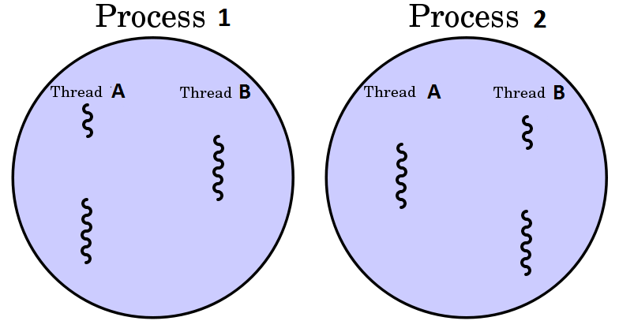
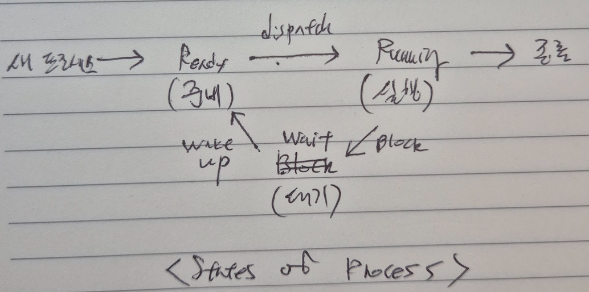
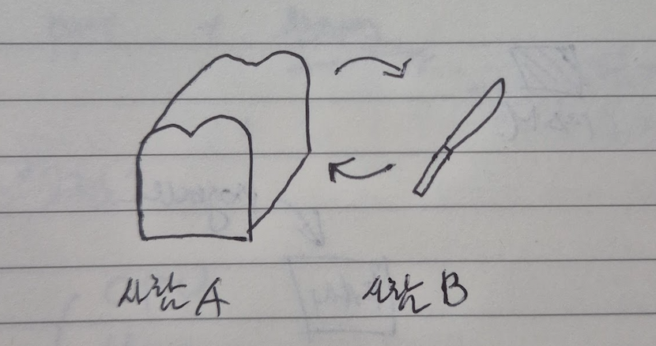

# Process

1. Process개념
1. PCB
1. Thread
1. 상태 전이
1. Process Scheduling 
1. 교착상태

## 프로세스 

메모리에서 실행중인 프로그램  
Program: 정적 상태

## PCB (Process Control Block)

각 프로세스는 고유의 PCB를 가집니다.
운영체제가 프로세스에 대한 중요한 정보를 저장해놓은 곳입니다.

*PCB 구성요소*

- PID (Process ID)
- 프로세스의 현재 상태
- 포인터
- CPU 레지스터 정보
- 주기억장치 관리 정보
- 입/출력 상태 정보
- 계정 정보

## Thread

프로세스의 구성을 제어/실행으로 나눌 때, `실행 부분`에 해당한다

## 프로세스 상태 전이

프로세스가 시스템 내에 존재하는 동안 상태가 변하는 것을 의미합니다.

**Spooling** 입출력할 데이터를 직접 입출력 장치에 보내지 않고 나중에 한꺼번에 입출력하기위해 디스크에 저장하는 과정입니다. 입출력 장치의 공유와 상대적으로 느린 입출력 장치의 처리속도를 보완하고 다중 프로그래밍 시스템의 성능을 향상시키기 위한 목적으로 수행됩니다.

**Ready** 프로세스가 준비 큐에서 CPU를 할당받기 위해 기다리는 상태

**Dispatch** 준비 상태에서 대기하고있던 프로세스 중 하나가 프로세서를 할당받아 실행 상태로전이되는 과정

**Run** 프로세스가 스케줄러에 의해 CPU를 할당받아 실행중인 상태

**Wait** 입/출력 처리가 필요한 경우 실행중인 프로세스가 일시 중지된 상태

**Wake Up** 입/출력 작업이 완료되어 프로세스가 대기 상태에서 준비 상태로 전이되는 과정

## 프로세스 스케줄링

CPU를 프로세스에게 할당하는 방법을 의미합니다.

- 비선점 스케줄링(Non-Preemptive)
- 선점 스케줄링 (Preemtive)

### 비선점 스케줄링

한 프로세스에게 이미 할당된 CPU를 다른 프로세스가 강제로 빼앗을 수 없습니다.
일괄 처리 시스템에 적합합니다.

*종류*

- FCFS
- SJF
- HRN
- 우선순위
- 기한부

### 선점 스케줄링

우선 순위가 높은 프로세스가 실행중인 다른 프로세스의 CPU를 강제로 빼앗을 수 있습니다. 우선순위가 높은 프로세스가 빠르게 처리될 수 있습니다. 대화식 시분할 시스템에 적합합니다.

*종류*

- Round Robin
- SRT
- 선점 우선순위
- 다단계 큐
- 다단계 피드백

## 교착 상태

두개 이상의 프로세스들이 자원을 점유한 상태에서 다른 프로세스가 점유하고 있는 자원을 요구하며 무한정 기다리는 상태를 의미합니다.

### 교착상태 발생조건

- 상호 배제
- 점유 및 대기
- 비선점
- 환형 대기

### 교착상태 해결방법

- 예방
- 회피
- 발견
- 회복
