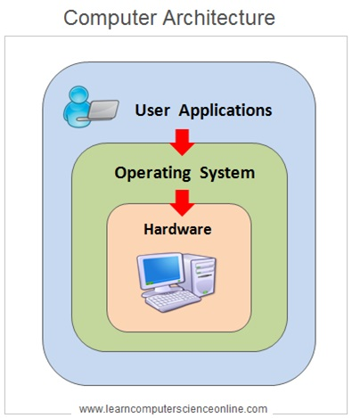
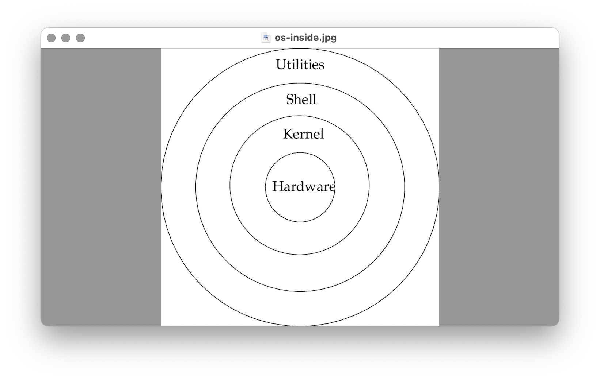

# OS

1. What is OS
1. 구조
1. File structures
1. Users
1. Commands

## OS 개념

It stands for Operating System  
Software between Hardware and Application

시스템 소프트웨어의 핵심 목적은 컴퓨터 자원(CPU, 메모리, 저장 장치, 입출력 장치 등)을 효율적으로 관리하고, 사용자가 시스템과 편리하게 상호작용할 수 있도록 기반을 제공하는 것입니다.

e.g) UNIX, Windows, Linux, Android

## 종류

..

## 구조

- Shell
- Kernel

### Shell

User interface

e.g) zsh, cmd

### Kernel

program

## 파일 구조

- usr
- var
- etc

## 사용자

- root (super user, system)
- admin
- staff
- everyone

## 쉘 명령어

### 기본 명령어

- ls -l  
list long. It shows authority info as well.

### 권한과 관련된 명령어

sudo chmod -R 777

- sudo: super user do
- chmod: change mode
- -R: recursive
- 777: rwx

### 명령어 옵션

One or two hyphen, they are identical in results.

- (One hyphen) + A character  
-- (Two hyphen) + A word

e.g) When you wanna get version info of programs
-v, - -version

### 쉘 명령어에서 변수 사용하기

You can use variables in terminal.  
define in configuration files.  
zsh의 경우  zshrc에서 설정한다

- 환경 변수
- 경로 변수

#### Enviromental variables

env commands to see all variables

#### Path variables

