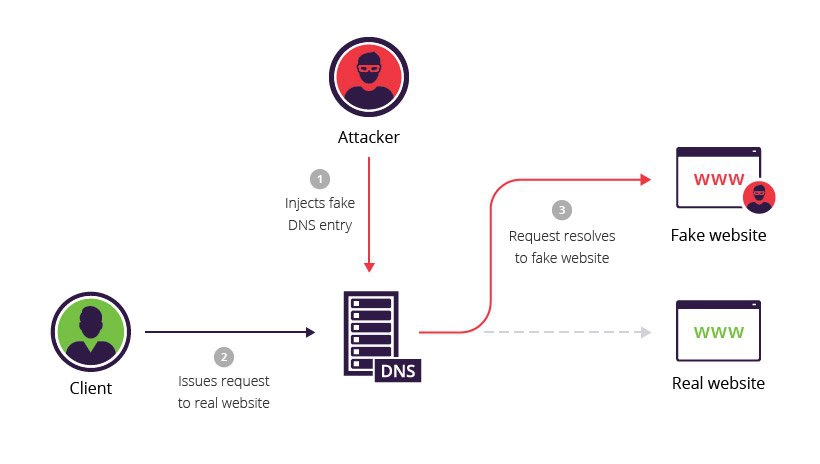

# 기타 공격

- XSS
- SQL Injection
- DNS Tunneling
- Zero day 
- Pileless
- Spoofing

## XSS (Cross Site Scripting)

웹페이지 또는 웹애플리케이션에 악성 코드를 삽입합니다. 일반적으로 JavaScript.  
사용자가 사이트에 방문하면 코드가 사용자의 웹브라우저에서 실행됩니다.
이를 통해 민감한 정보를 훔치거나 악성 웹사이트로 사용자를 이동시킵니다.

## SQL 주입 (SQL Injection)

데이터베이스에 악성 명령을 삽입하여 데이터를 빼거나 데이터를 왜곡시킵니다.
해커는 검색폼이나 로그인폼을 활용해 데이터베이스에 삽입할 명령을 입력합니다.

## 제로데이 공격 (Zero Day Attack)

보안 커뮤니티에 알려지지 않았거나 알려졌지만 아직 해결 방법이 발견되지 않은
취약점(제로 데이)를 공격합니다.

## Spoofing

속이기(Spoofing)

- DNS Spoofing
- ARP Spoofing

### DNS Spoofing

DNS 서버의 레코드를 몰래 편집하여 웹사이트의 IP주소를 조작합니다.
피해자는 `가짜 사이트`에 접속하게 됩니다.

**DNS 서버** 문자형식의 URL을 IP 주소로 변환하는 서버

### ARP Spoofing

ARP의 취약함을 이용한 공격 기법입니다. 공격자의 물리적 주소(MAC)를 피해자의 것으로 변조하여 피해자에게 도달해야 하는 데이터 패킷을 가로채는 공격입니다.

**ARP(Address Resolution Protocol)** 호스트의 IP주소를 호스트와 연결된 네트워크 접속 장치의 물리적 주소(MAC Address)로 변환시키는 프로토콜