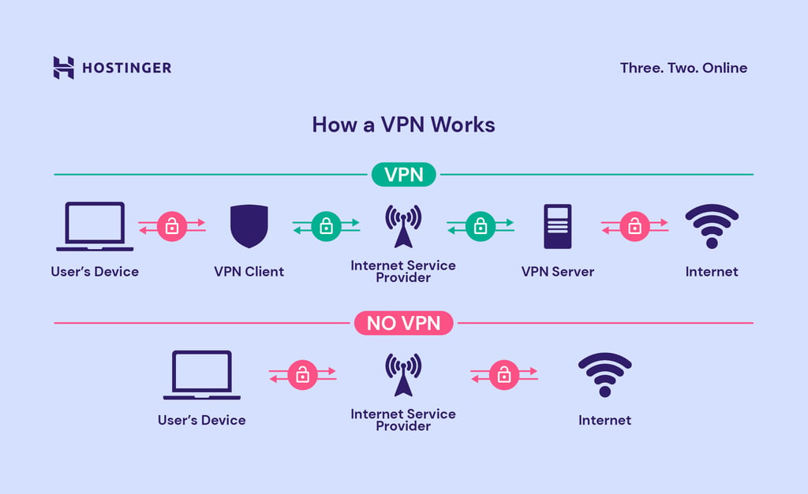

# 보안 솔루션

1. 방화벽 
1. VPN
1. IDS, IPS
1. DLP
1. NAC
1. ESM
1. TKIP

## 방화벽

공격자가 내부 네트워크에 침입할 수 없도록 트래픽을 모니터링하고 제어한다.
방화벽은 일반적으로 신뢰할 수 있는 네트워크와 신뢰할 수 없는 네트워크 사이에 있다. 
신뢰할 수 없는 네트워크는 인터넷인 경우가 많다

## VPN (Virtual Private Network)
  
사용자에 대한 정보는 웹 사이트 요청의 모든 단계에서 노출됩니다. 사용자의 IP 주소는 프로세스 전반에 걸쳐 노출되므로 ISP 및 기타 중개자는 사용자의 검색 습관에 대한 로그를 유지할 수 있습니다. 또한 사용자의 장치와 웹 서버 간에 전송되는 데이터는 암호화되지 않습니다. 

따라서 악의적인 행위자가 데이터를 염탐하거나 경로상 공격과 같은 사용자 공격을 수행할 기회가 생깁니다. 반대로, VPN 서비스를 사용하여 인터넷에 연결하는 사용자는 더 높은 수준의 보안과 개인정보 보호를 누릴 수 있습니다.

VPN 클라이언트와 VPN 서버 사이의 VPN 터널은 ISP를 통과하지만, 모든 데이터가 암호화되기 때문에 ISP는 사용자의 활동을 확인할 수 없습니다. 
VPN 서버의 인터넷 통신은 암호화되지 않지만, 웹 서버는 VPN 서버의 IP 주소만 기록하므로 사용자에 대한 정보는 제공되지 않습니다.

**VPN클라이언트** 사용자의 장치에 설치된 VPN 소프트웨어입니다.

### VPN 사용 이유

**공용 WiFi로부터 보호** 동일한 네트워크의 다른 사용자가 해당 사용자의 활동을 모니터링할 수 있습니다.

**원격 작업** 원격 직원이 회사 내부 네트워크에 액세스하기위해

**검열 회피** 독재 국가에서의 검열로부터의 자유. 해당 국가에서 차단하려는 콘텐츠에 액세스가 하거나 자유로운 의사표현 가능

**위치 익명성** 일부 웹 서비스에서는 사용자의 위치에 따라 콘텐츠를 제한하거나 필터링합니다. VPN을 이용하여 사용자의 위치를 감추고 이러한 제한을 피할 수 있습니다.

**개인정보 보호** ISP 또는 일부 웹사이트들은 방문 사이트 등 사용자와 관련된 데이터를 판매한다. 이를 원치 않는 경우 사용한다

## IDS / IPS

### IDS 

침입 탐지 시스템 (Invasion Detection System).  
컴퓨터 시스템의 비정상적인 사용을 실시간으로 탐지하는 시스템입니다.

**오용 탐지(Misuse Detection)** 미리 입력해 둔 공격 패턴이 감지되면 알려줍니다

**이상 탐지(Anomaly Detection)** 평균적인 시스템의 상태를 기준으로 비정상적인 행위나 자원의 사용이 감지되면 알려줍니다

### IPS 

침임 방지 시스템 (Invasion Prevention System).  
비정상적인 트래픽을 능동적으로 차단하고 격리하는 등의 방어 조치를 취하는 보안 솔루션입니다. 
방화벽과 IDS를 결합한 시스템입니다.
IDS 기능으로 패킷을 하나씩 검사한 후 비정상적인 패킷이 감지되면 방화벽 기능으로 해당 패킷을 차단합니다.

## DLP

데이터 유출 방지 (Data Loss Prevention).  
DLP 툴을 활용하여 중요한 데이터를 암호화하고 접근 현황 및 사용량을 모니터링한다.
의심스러운 활동이 감지될 때 경고를 표시한다.
정기적으로 데이터를 백업하여 침해가 발생한 경우 피해를 최소화 한다.

