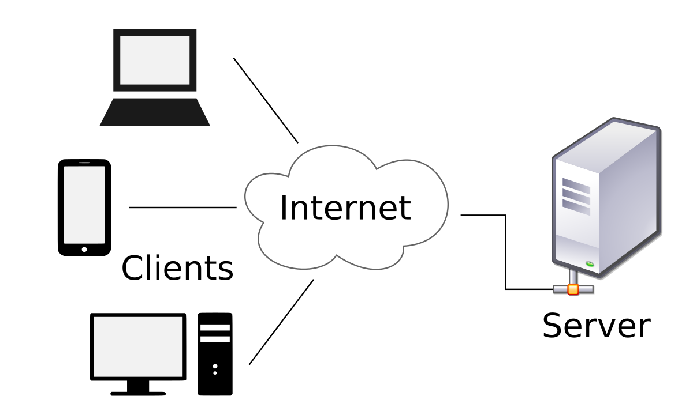

# Server

1. 서버 개념
1. 서버 종류


## 서버란?

클라이언트의 요청에 응답하는 컴퓨터  
**클라이언트** 서버에 요청하는 대상. 주로 웹 브라우저

서버와 클라이언트의 관계를 알아봅시다.
우선 사전적 의미로 접근해봅시다. 
서버(server)는 '섬기는(serve) 사람 또는 물건'을 의미합니다.
서비스(service)를 제공한다는 뜻이죠. 
마치 식당에서 여러분에게 음식과 서비스를 제공하는 종업원처럼요.
클라이언트(client)는 고객을 의미합니다.
식당을 방문한 순간 여러분은 그 식당의 클라이언트입니다.
서버와 클라이언트의 관계, 어렵지 않죠? 

컴퓨터 분야에 적용을 해보겠습니다.
예를 들어 여러분이 필요한 문서를 검색을 하기위해 구글 홈페이지에
접속하는 과정을 생각해보세요.
검색 서비스를 활용하며 문서를 요청하는 여러분은 고객이고
여러분에게 구글 문서를 제공하는 대상은 바로 서버입니다.
(더 정확히 말하자면 클라이언트는 여러분의 기기에 설치된 웹 브라우저 입니다.)
식당에 여러 고객이 있는 것처럼
서버는 여러분 뿐만 아니라 전세계에 흩어져있는 고객들에게
서비스를 제공하기 위해 지금 이시간에도 열일하고 있답니다.
(그래서 서버실은 엄청나게 춥다고 해요)




## 서버 종류

- Web Server
- WAS
- File server
- Mail server


## Web Server

웹 브라우저의 요청을 받아 정적인 콘텐츠를 제공합니다.

**정적인 콘텐츠** html/css/js, 이미지, 비디오/오디오 등

**종류** Apache, Nginx 등

```
웹의 초기에는 오직 웹서버만 존재했습니다.
따라서 정적인 콘텐츠만 소비할 수 있었습니다.
정적인 콘텐츠란 무엇일까요? 말그대로 고정된 콘텐츠라는 뜻입니다.
마치 모든 사람들에게 똑같은 신문처럼요.

html/css/js은 UI 분야에서 자세히 다루겠지만
간단히 말하면 신문과 같은 문서라고 생각할 수 있습니다
신문과 다른 점이 있다면 인터넷을 통해 제공되는 문서라고 할 수 있겠네요.
```

## WAS (Web Application Server)

웹 서버에서 받은 요청을 기반으로 동적 콘텐츠 제공, 사용자 인증, 비즈니스 로직 처리 등을 수행합니다.

**종류** Tomcat, Jeus, WebSphere 등

```
동적 콘텐츠란 무엇일까요? 정적 콘텐츠와 반대개념이겠죠?
정적 콘텐츠와는 반대로 모든 사람들이 똑같은 화면을 보지 않고
개인 맞춤형이라고 볼 수 있습니다.

전자상거래 사이트를 생각해보면 금방 납득이 됩니다.
모든 사람들은 각자 다른 장바구니, 쇼핑 기록을 가지고 있습니다.
현대의 대부분의 웹사이트는 정적 콘텐츠를 제공합니다.
지금 떠오르는 동적 웹사이트가 많이 있죠? 😁
```

### 웹서버와 WAS의 관계

웹 서버와 WAS는 함께 작동하여 클라이언트 요청을 처리하고 사용자에게 올바른 콘텐츠를 제공합니다. 
새 요청은 항상 웹 서버에 먼저 수신됩니다. 웹 서버에서 정보를 생성할 수 있는 경우 그렇게 한 다음 응답을 보냅니다.

사용자가 필요로 하는 콘텐츠가 충분하지 않은 경우 웹 서버는 해당 요청을 WAS에 전달합니다. 그러면 WAS가 데이터를 처리하고 비즈니스 로직을 사용하여 올바른 정보를 제공합니다. 그런 다음 정보를 웹 서버로 다시 전달하고, 웹 서버가 이를 사용자에게 전달합니다.

```
여러분이 요청하는 것이 만약 이미지, 다운로드용 파일 등이라면 웹서버로 충분합니다. 하지만 모던 웹페이지의 대부분의 요청은 WAS가 필요합니다.
```