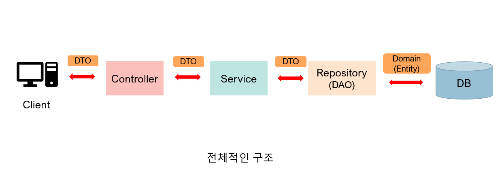

# Server Program

1. 서버 프로그램 개념
1. 서버 프레임워크
1. 프레임워크의 특성
1. 프레임워크 구조


## 서버 프로그램

서버를 만들 때 사용하는 프로그램

서버? 서버 프로그램? 조금 혼란스러울 수 있습니다. 
서버는 보통 역할을 의미합니다. 
서버는 우리가 매일 사용하는 컴퓨터와 비슷한 컴퓨터입니다.
(운영체제는 보통 LINUX를 씁니다)
컴퓨터에 서버 프로그램을 작동시키면 그 컴퓨터는 서버가 되는 것이지요.


## 서버 프레임워크

Framework는 '뼈대', '골격'을 의미합니다.
집을 지을 때를 생각해봅시다.
만약 우리가 살 집을 지을 때 처음부터 짓는다면 힘들 것입니다.
그런데 만약 누군가 기본 뼈대를 만들어준다면
훨씬 빠르고 쉽게 만들 수 있겠죠?
또한 뼈대는 겉으로 잘 드러나지 않으므로
개성있는 나만의 집을 짓는것도 가능합니다.

프레임워크의 역할도 마찬가지 입니다.
소프트웨어를 빠르고 효율적으로 개발할 수 있도록 도와줍니다.

*개발 언어별 대표 프레임워크*

- Spring (Java)
- Express (Node.js)
- Django (Python)
- Codeigniter (PHP)
- Ruby on rails (Ruby)


## 서버 프레임워크의 4가지 특성

1. 모듈화 (Modularity)
2. 재사용성 (Reusability)
3. 확장성 (Extensibility)
4. 제어의 역전 (Inversion of Control)


**모듈화** 프레임워크는 독립적인 여러 모듈로 구성되어 개발 및 관리가 간편하다.

**재사용성** 프레임워크는 재사용 가능한 모듈을 제공한다

**확장성** 프레임워크는 확장이 가능하여 다양한 크기의 앱 개발이 가능하다.

**제어 역전** 개발자가 관리해야 하는 객체들을 프레임워크에 넘김으로써
생산성을 향상시킨다


## 서버 프로그램의 구조

- Controller
- Service
- DAO
- DTO




### Controller

클라이언트와 통신하는 객체

### Service

논리(로직)를 담당하는 객체

### DAO

Data Access Object  
데이터베이스에 접근하여 데이터를 다루는 객체 

### DTO

Data Transer Object  
모듈 간 데이터 교환을 위해 사용되는 객체

### Entity

DAO와 DB 간 데이터 교환을 위해 사용되는 객체

```
여러분이 구글의 검색서비스를 이용하는 상황을 가정해봅시다.
여러분은 검색창에 '고양이 사진'을 입력하고 '검색' 버튼을 눌러 폼을 제출합니다.
그러면 서버로 여러분이 입력한 '고양이 사진' 값이 전달됩니다.

가장 먼저 사용자의 요청을 맞이하는 것은 컨트롤러입니다. 
컨트롤러는 해당 요청을 서비스에 전달합니다.
서비스는 '검색'이라는 작업에 적합한 로직을 처리합니다.

사용자의 검색어에 알맞은 데이터들을 도출하기 위해 DAO에
데이터베이스 작업을 요청합니다.
DAO는 데이터베이스를 탐색 후 알맞은 문서들을 서비스에 반환합니다.

서비스는 검색 결과를 컨트롤러에 전달하고
컨트롤러는 최종적으로 사용자에게 검색 결과를 담은 문서를
전송합니다. 마침내 사용자는 검색 결과를 볼 수 있게됩니다.
```